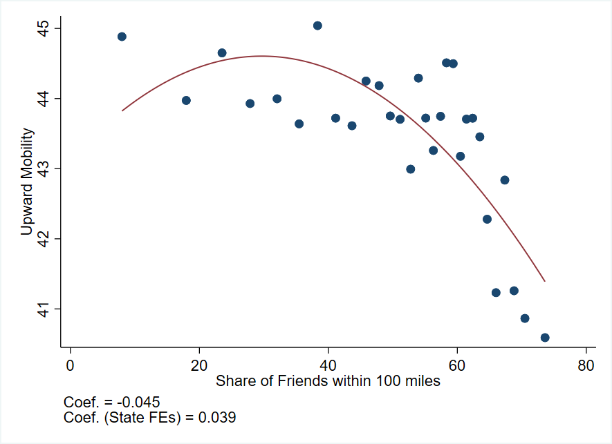
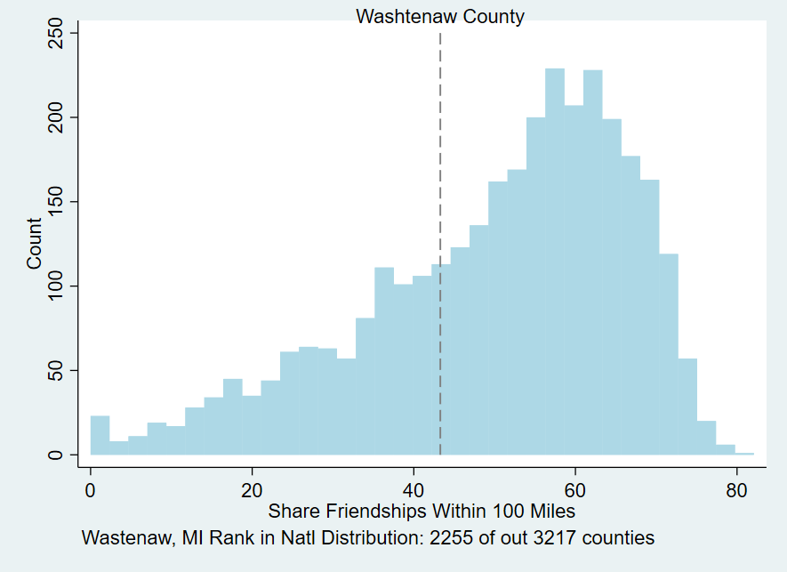

## Stata-Coding-Sample

* working with the Social Connectedness Index (SCI), a dataset built from an anonymized snapshot of Facebook users and their friendship networks. 
* The data measures the intensity of social connections between counties. 
* For one overview, see this coverage in the [New York Times](https://www.nytimes.com/interactive/2018/09/19/upshot/facebook-county-friendships.html).  

